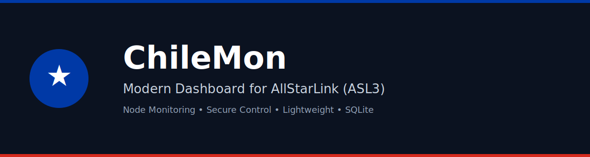
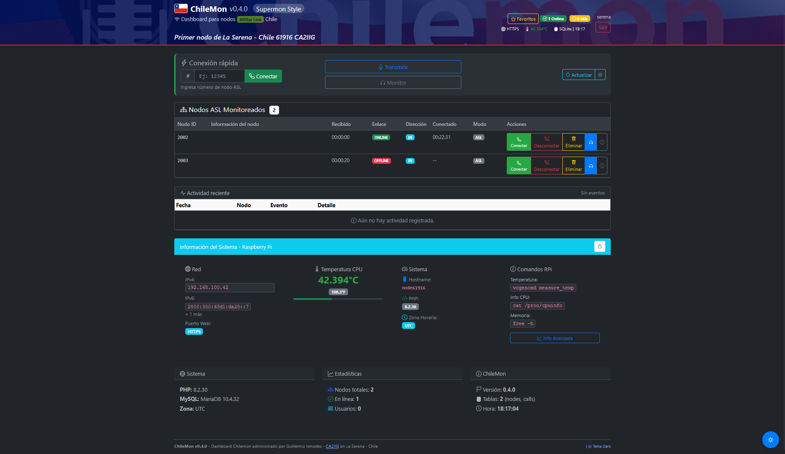
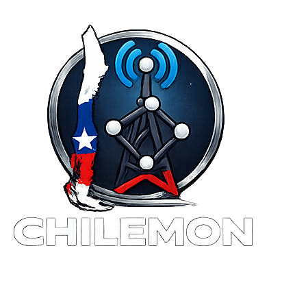
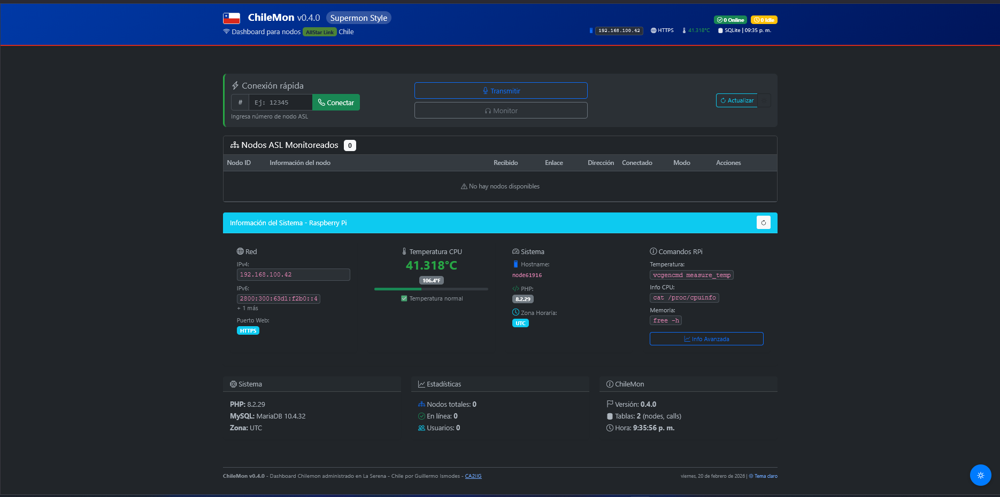
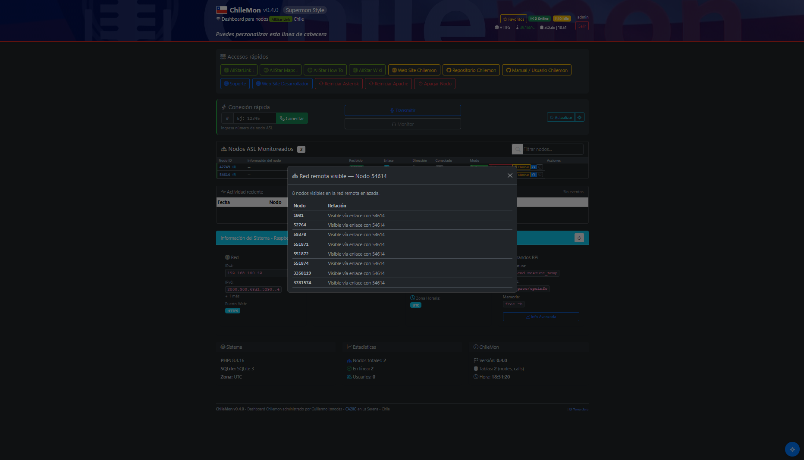
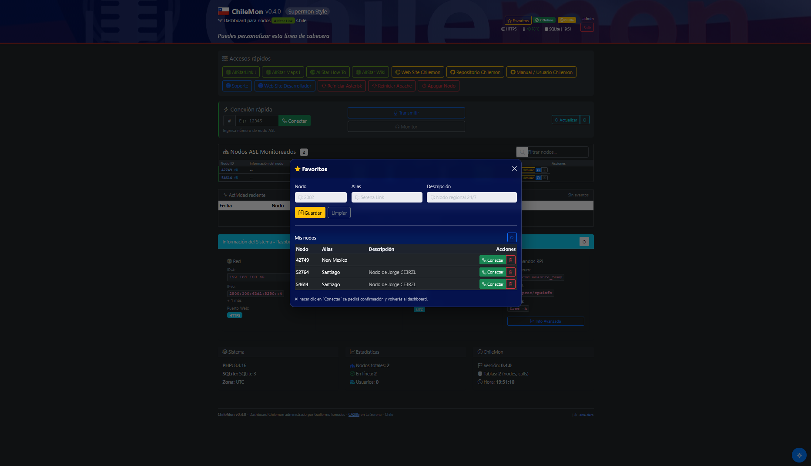

<p align="center">
  
</p>

<p align="center">

</p>

##

<p align="center">
Modern dashboard for monitoring and controlling AllStarLink nodes
</p>

<p align="center">


</p>

#
# 
<p align="center">
  
</p>

A modern dashboard for monitoring and controlling **AllStarLink (ASL3)** nodes. ChileMon was created as a modern alternative inspired by **Supermon**, designed to provide a clearer, more modular, and easier-to-install interface for AllStar node operators.

The goal of the project is to provide a simple and secure tool to view and control the activity of an AllStarLink node from a web browser.

## 🌐 Languages

🇪🇸 Spanish documentation: `README_ES.md`  
🇬🇧 English documentation: `README.md`

---

# 📡 What is ChileMon?

ChileMon is a web application that allows you to:

- monitor connected nodes
- connect remote nodes
- disconnect nodes
- visualize the linked node network
- review node statistics
- manage favorite nodes
- view recent activity

All from a modern web interface.

---

# ✨ Main Features

ChileMon currently includes:

- Web dashboard for AllStarLink node monitoring
- Remote node connection and disconnection
- Real-time visualization of connected nodes
- Node statistics obtained from Asterisk
- Modal window to visualize the linked node network
- Favorite node management
- Recent activity logging
- Secure command execution through a wrapper
- Automatic installer for ASL3 systems

---

# 🧠 Project Philosophy

ChileMon was designed with the following principles:

- **Do not interfere with AllStarLink**
- **Do not modify Asterisk**
- **Do not replace Supermon**
- **Be a modular tool**
- **Be easy to install**
- **Be secure**

ChileMon works as an **additional module**, without altering the node’s base installation.

---

# 🏗 Architecture

ChileMon is built using simple and robust technologies.

### Backend

- PHP 8+
- SQLite

### Frontend

- Bootstrap 5
- JavaScript
- AJAX

### Server

- Apache

---

# 🔐 Security

ChileMon **does not execute Asterisk commands directly from PHP**.

Instead, it uses a secure wrapper:

```php
/usr/local/bin/chilemon-rpt
```

This wrapper allows only specific commands to be executed:

 - rpt nodes
 - rpt stats
 - rpt connect
 - rpt disconnect

The commands are executed through a restricted sudo rule for the user:

```php
www-data
```

This prevents arbitrary command execution on the system.

---

## ⚙ How ChileMon Works

ChileMon obtains node information by running Asterisk rpt commands.

Example:

```php
sudo -u www-data sudo -n chilemon-rpt nodes 494780
```

The output is processed by the service:

```php
src/Services/AslRptService.php
```

This service interprets the Asterisk output and extracts information such as:

 - connected nodes
 - node status
 - system statistics

The processed data is then displayed on the web dashboard.

---

## 🖥 Dashboard

The main dashboard allows you to view:

 - local node
 - connected nodes
 - system status
 - linked node network
 - recent activity

It also allows you to:

 - connect nodes
 - disconnect nodes
 - manage favorites

---

## 🔎 ChileMon vs Supermon

Supermon is the classic interface used by many AllStarLink nodes.

ChileMon is inspired by that concept, but introduces a more modern architecture.


| Feature	| Supermon	| ChileMon |
|---|---|---|
| Interface	| Classic HTML	| Modern dashboard |
| Authentication | Basic login | User system |
| Database | No | SQLite |
| Installation | Manual | Automatic installer |
| Architecture | Monolithic | Modular |
| Extensibility | Limited | Designed for expansion |

ChileMon **does not replace Supermon**, but instead offers a modern alternative for node monitoring and control.

---

## 📷 Screenshots

### Dashboard



### Red de nodos



### Favoritos



---


# 🚀 Installation Options
ChileMon can be installed directly on an **ASL3** node. It is recommended to use a Debian-based system (such as the official ASL3 image).

### 📦 Stable Release (Auto-Installation)

This is the fastest and most automatic way. Just copy and paste these commands into your terminal (make sure to have your node ID and AMI password ready):

```bash
# 1. Clone stable version and install everything at once
sudo git clone -b v0.1.0 https://github.com/gismodes37/Chilemon.git /opt/chilemon
cd /opt/chilemon && sudo bash install/install_chilemon.sh
```

---

### 🧪 Option 2: Main Branch (Experimentation and Development)
To test the latest features in development (v0.2.x), you can clone the repository directly:

```bash
# 1. Clone the repository
sudo git clone https://github.com/gismodes37/Chilemon.git /opt/chilemon

# 2. Enter the directory
cd /opt/chilemon

# 3. Run the automatic installer
# (Make sure to have your node ID and AMI password ready)
sudo bash install/install_chilemon.sh
```

The installer will automatically configure Apache, PHP, SQLite, and the security wrapper so ChileMon is ready at `http://your_ip/chilemon`.

 ---

 ## 📂 Project Structure


    chilemon/
     │
     ├── app/
     │   └── Core/
     │       └── Database.php
     │
     ├── config/
     │   ├── app.php
     │   └── database.php
     │
     ├── data/
     │   └── chilemon.sqlite   (should not be versioned)
     │
     ├── logs/
     │
     ├── public/
     │   ├── index.php
     │   ├── login.php
     │   ├── logout.php
     │   ├── api/
     │   │   ├── log-call.php
     │   │   ├── nodes.php
     │   │   └── stats.php
     │   └── assets/
     │
     ├── install/
     ├── bin/
     ├── README_ES.md
     ├── README.md
     ├── CHANGELOG.md
     ├── LICENSE.md
     └── .gitignore

---

## 📈 Roadmap


Initial functional release


Real-time RX/TX activity (Available)


Full Favorites Integration & Simplified Installer (New)


Extended events and statistics


Stable release

---

## 📦 Release

# 📦 Releases

## v0.3.0
- **Full Favorites Integration**: Star icon and alias display in the dashboard.
- **Quick Toggle Button**: Manage favorites directly from the node table.
- **Simplified Installer**: New faster one-block installation process.

## v0.2.x
- **Real-time monitoring**: Dynamic RX (green) and TX (red) indicators.
- **EchoLink Support**: Automatic identification of EchoLink connections.
- **Wrapper v0.2.3**: Security improvements and parameter cleaning.

## v0.1.0 (Legacy)

First functional release of ChileMon.

Includes:

 - Operational dashboard
 - Node connection and disconnection
 - Node network visualization
 - Favorites management
 - Recent activity
 - Automatic installer
 - AllStarLink integration

 ---

 ## ❤️ Support ChileMon

ChileMon is an independent project developed for the **amateur radio** and **AllStarLink** community. If this project is useful to you, you can support its development with a **voluntary donation**.

### What do donations help with?

ChileMon is developed independently. Donations help sustain the project and allow it to continue improving.

- Continuous dashboard development
- Testing on real AllStarLink nodes
- Security and stability improvements
- Project documentation and website
- Maintenance and future evolution

### Ways to support

- **PayPal:** [Support Chilemon](https://www.paypal.com/ncp/payment/J56JZF5CPRBVG)
- **GitHub Sponsors:** [gismodes37](https://github.com/sponsors/gismodes37)

You can also support the project by contributing code, reporting bugs, or testing ChileMon on real nodes.

> ChileMon is a community project for amateur radio operators. Donations are completely voluntary and help sustain the development of the project.

---


 ## 🤝 Contributions

Contributions are welcome.

If you would like to collaborate:

 1. Fork the repository
 2. Create a new branch
 3. Submit a pull request

 ---

 ## 📄 License

ChileMon is distributed under the MIT


---

